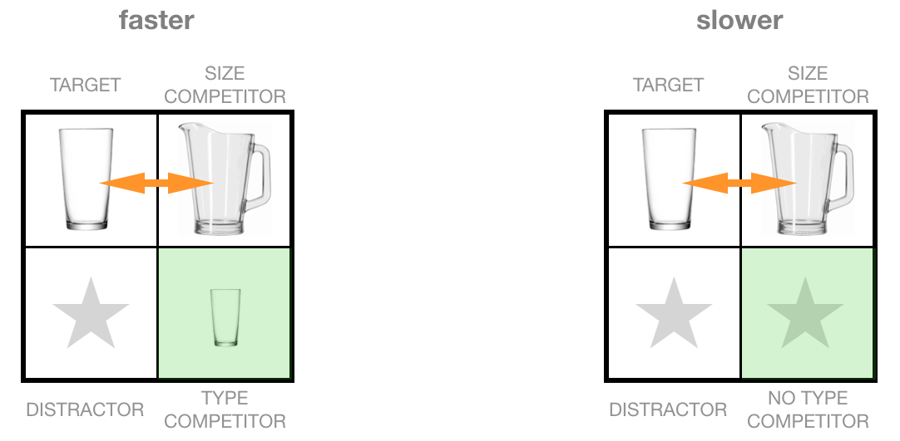
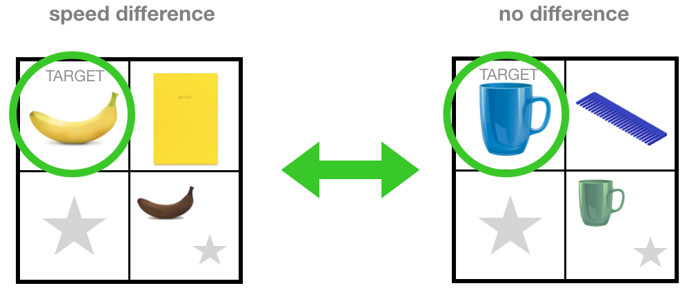
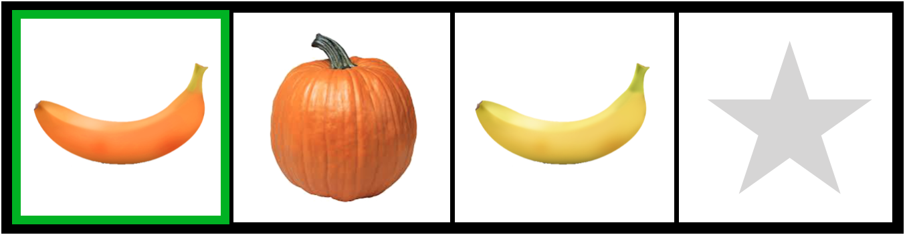
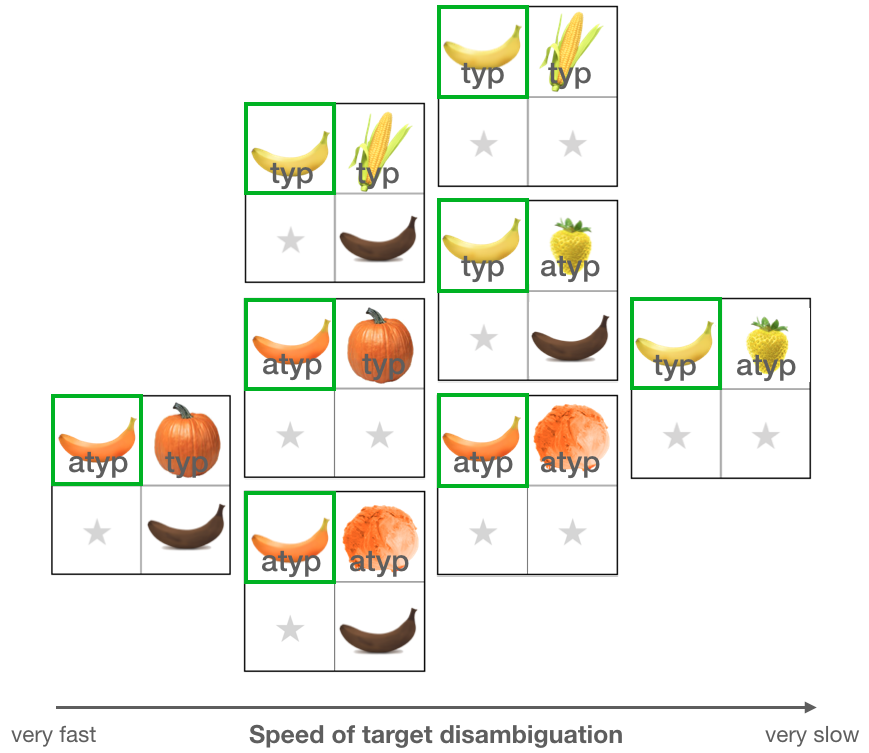
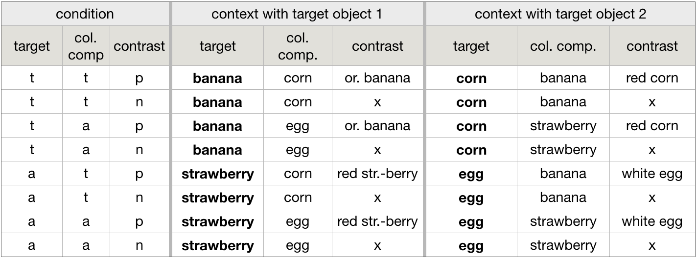

# This is a preliminary title for my first QP

## The (original) contrastive inference paradigm (Sedivy, 1999)

Using eyetracking, Sedivy showed participants can use context information to disambiguate two competitors.

Given the utterance "Pick up the tall...", there are two possible referents -- the tall glass and the tall pitcher. When participants are presented with these two objects and two random distractors, they can't disambiguate the target from its competitor. However, if there is also a small glass in the context, their proportion of looks to the tall glass increases. Sedivy calls this the contrastive inference effect. She takes the results as evidence for the hypothesis that modifiers in general elicit contrastive inferences (they establish a referent that is in contrast to another object in the relevant context).

When trying to replicate these results with color modifiers, she found that there is a contrastive inference effect when using yellow banana targets (typically colored color-diagnostic objects), but not for blue cups (non-color diagnostic objects) (Sedivy, 2003). She ties that back to the different prior proportions of modifier productions for these items ("yellow banana" is rare, whereas "blue cup" is apriori more likely).

## The ideas

### The tale of the methodological endeavor -- Linking production expectation and online pragmatic interpretation

- research questions
	- 1) Are the looks to the target proportional to the proportion of modifier mention in the production experiment?
	- 2) To what extent do we observe contrastive inference and is the size dependent on the nature of the color competitor?
- what do these results mean for previous studies using eyetracking/contrastive inference/typicality?
	

##### The subtale of audience-design

- if we can find that listeners do seem to consider the speaker's perspective, this provides a strong case of audience design (relates to research question (1))
- a lot of experiments that claim audience design had to employ explicit instructions like "consider the speaker's perspective"; in this experiment, everything is implicit

### The tale of processing

- there is a lot of literature on processing that uses experimental results from typicality manipulation and using the contrastive inference paradigm (separately)
- how do my results effect the interpretation of their results? would the incorporation of my results favor one account over others?

### The tale of the two pressures

- research question
	- **Are the two pressures independent and equally strong? (Hierarchy is the null hypothesis,...)** *-- is that a good question to ask?*
- for each object in a context, two pressures determine whether a modifier is used or not: the context-driven pressure and the object-driven pressure
- assumption: listeners reason about likely speaker utterances and make inferences when expectations are violated
- then, listeners can use the information about the fact that a color modifier is used to already draw conclusions (make informed guesses) what the intended referent is
- what inferences are drawn and their strength is determined by the two pressures mentioned above
- given these postulations, we can create a hierarchy of contexts with respect to their inference strength
- however, we don't know whether the two pressures interact and/or are equally strong or not, which makes it impossible to visualize
- therefore, we stipulate two assumptions (that are most likely wrong):
	- 1) the two pressures are independent of each other
	- 2) the two pressures are equally important (contribute equally to likelihood of modifier mention)

##### The object pressure

- This pressure is created by properties of the object itself, independent of the context.
- Examples
	- typicality effect: If an object is presented in an atypical color, color modifier use is increased.

##### The context pressure

- This pressure is created by the context an object is presented in. 
- Examples
	- contrast presence: If there is an object of the same type present, mentioning the color becomes relevant to avoid ambiguitiy.
	- scene variation: The higher the scene variation, the more likely the use of a color modifier. 

	
##### Example: the two pressures working together

Consider this context with an atypical target (orange banana), an atypical color competitor (orange lettuce), a contrast (another banana) and another irrelevant distractor. Furthermore assume you heard "Click on the orange..." but couldn't hear the noun. What is the reasoning that you can employ?

Let's look at all objects individually first (**object pressure**).
We can already disregard the yellow banana and the random distractor because they are not orange. The goal is to disambiguate between the two orange objects: the banana and the pumpkin.
There is a reason to say the color for the orange banana, because the color is atypical for the object (*typicality effect*). There is no such reason to mention the color for the pumpkin, because it is typical.

Now, we will turn to the context the objects are presented in (**context pressure**).
There are two bananas in the context. Therefore, a color modifier needs to be included if we want to avoid an ambiguous reference. For the lettuce, this pressure is not at work because there is only one.

In summary, there are two reasons to use the color modifier for the banana: its atypicality and the presence of a contrast. There is no reason to mention the color for the lettuce, because it is neither atypical nor is there another pumpkin present in the context. Therefore, if both pressures are independent of each other and equally strong, more evidence speaks for the orange banana as a target, opposed to the lettuce. The hypothesis is that the amount of evidence/reason for color mention affects how quickly listeners are able to disambiguate the target from its color competitor.

##### Overall hierarchy

Assuming that the pressures are independent of each other and equally strong, we can create a hierarchy for the speed of target disambiguation for all 8 conditions. 
The more a context is positioned to the left, the faster a listener should be in disambiguating the target from the color competitor after hearing the color. 

To the very right is the context for which I predict the slowest target identification. The target is a typical object, the color competitor is atypical and there is no contrast present. A listener can reason that there is no pressure to mention color for the banana because it is typical and there is no other banana in the context. However, there is a reason to mention the color for the strawberry because the color is atypical for the object. A listener could infer that the strawberry is the more likely target in this case. Thus, this context is misleading since it suggests that the color competitor is the target instead of the actual intended target.

The context at the left end of the figure should show the fastest target disambiguation (assuming that the pressures are independent and equally strong). The color competitor is typical which means that the listener has no reason to believe that the speaker would mention a color to refer to it. However, both of the pressures speak for the target object. First of all, it is atypically colored which makes a color modifier more likely. Second of all, there is another object of the same type (a contrast) present, which makes the color modifier actually necessary for disambiguation. Therefore, all evidence suggests that the color modifier is used to refer to the intended target: typical color competitor, atypical target, contrast present.

In the third column from the left are the contexts with conflicting evi- dence. Here, uttering a modifier is equally likely for the target and the color competitor. Trivially, this is the case when both objects are typical or both are atypical (and no contrast is present). When we assume equally strong pressures, then the case of unresolvable conflicting evidence is also true when the target has a type competitor and the color competitor is atypical.

The remaining contexts belong to the second column from the left. There is more evidence that speaks for the intended target, but it is still not the most facilitating context. As in column three, there are again two contexts where the target and the color competitor are both typical or both atypical. But additionally, there is now a contrast present which suggests that the banana should be favored over its color competitor. The third context in this category has an atypical target (orange banana) and a typical color competitor (orange pumpkin), but no contrastive banana. Here again, color mention suggests the banana as the intended target, but the contrast is lacking for a maximum amount of evidence.

## The experiment

### Stimuli

- conditions: 8 
	- 2 (target typicality) x 2 (competitor typicality) x 2 (contrast presence) design 
- stimuli: 10 objects (each in a typical and atypical color)
	- i.e., 5 colors (each with 2 typically and 2 atypically colored objects)
	- i.e., 20 items
- total number of critical contexts: 80
	- 8 conditions * 10 objects (typicality is already included in conditions)
- each context consists of 4 objects: target, color competitor, optionally a contrast and then filled up with "random" distractors
	- random distractors should not have the same color as any of the other objects in the display and be of a different type

### Procedure

- every participant goes through 55 trials/contexts (20 critical, 35 fillers; 30 contain modified and 25 contain unmodified utterances)
- critical trials
	- = trials with contexts that are of interest (are in compliance with the conditions and in the comprehension experiments combined with a color modified referring expression)
	- 2 measures of splitting the set (from 80 to 20 critical trials per participant)
		- 1) color competitor typicality is between subject manipulation, resulting in a 2 x 2 design (4 conditions) (80 -> 40)
		- 2) don’t use all 10 objects but only one object for each color drawn randomly for each condition
			- each of the 5 colors contributes 16 critical contexts (two for each condition, because each color has two typical and two atypical objects); consider condition **tap** (typical target, atypical competitor and contrast present) in color yellow, then this can be realized with two different targets (banana and corn), i.e., *yellow banana, yellow strawberry, orange banana* and *yellow corn, yellow strawberry, red corn*; participants will only see one of the two (selected randomly) as a critical trial
- filler trials
	- = trials that distract from true purpose of the study and to ensure that listeners perceive the speaker as a natural speaker
	- 2 purposes
		- since all critical trials have color modified utterances associated with them, we need to have trials without color modification
		- we need to make sure that targets are not logically derivable (two things that are yellow and two things that are bananas shouldn’t automatically mean that the target is the yellow banana)
	- selection of filler trials
		- they are the left over ones from the second splitting measure (i.e., when the critical context for color yellow in condition ttp contained a yellow banana, yellow corn, and an orange banana, the context with yellow corn as “target”, yellow banana and red corn will be in the fillers)
- given that each participant will see 20 critical trials, they will see
	- 5x utterance: modified; target: color competitor
	- 5x utterance: unmodified; target: color competitor
	- 20x utterance: unmodified; target: random distractor
	- 5x utterance: modified; target: contrast
- all contexts have two objects of the same color in them 
	- minimizes the prior participants could have about the potential target given the context

##### Overview on conditions for "yellow"

This table exemplifies the different conditions for the color yellow. The selected typical objects for this color are *banana* and *corn*, and the atypical objects are *strawberry* and *egg*. Each of these can occur as a target. However, contexts can be different but still fulfill the same condition. Each line in this table is one condition and has two example contexts with different targets. To reduce the number of critical trials per participant, we select one of the two. The other one serves as a filler context.

## Note

- terminology:
	- object = things that are of the same type but not necessarily color, i.e., *bananas* are objects
	- item = every unique instance of a thing (each color and type combination is a separate item), i.e., *yellow bananas* and *green bananas* are different items (but the same object)
	- context = every unique instance of a display
	- condition = groups of contexts that have the same structure, independent of the objects used, e.g., *typical target, atypical competitor and contrast present* is one condition 