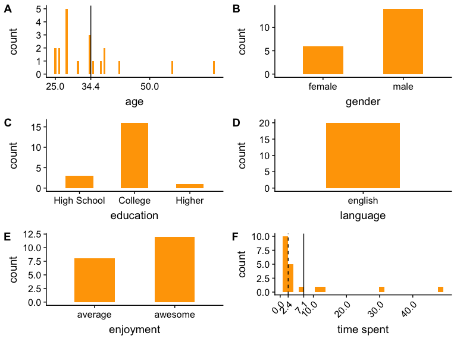

CI: object naming analysis
================

### About the participants (after exclusion)

Object descriptions
-------------------

#### Color diagnostic objects

"other" utterances: swan is often called a goose; two people identified the white carrot as parsnip

##### By trial analysis

The difference between typical and atypical objects decreases with the second observation of the item.

#### Non-color diagnostic objects

"other" utterances: mug is still often called a cup; jacket is often called "coat"

