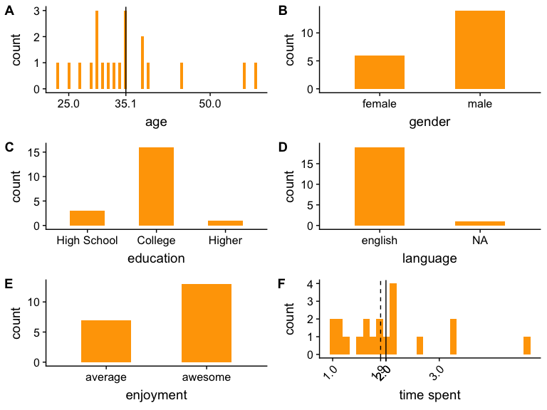

CI: object naming analysis
================

### About the participants (after exclusion)

Object descriptions
-------------------

#### Color diagnostic objects

##### By trial analysis

Difference between typical and atypical objects increases over time (in contrast to the free production which results in overproduction of modifiers over time)

#### Non-color diagnostic objects

Only "other" mention: the red book was described as "the orange book".

