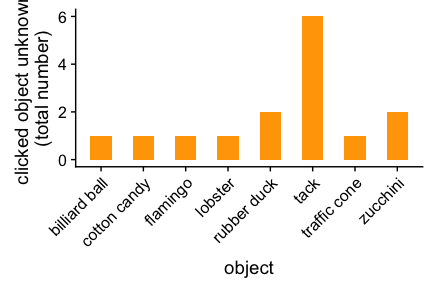

CI: feature norming analysis
================

### About the participants (after exclusion)

Objects which were rated unknown
--------------------------------

Plot proportion of color mention (only cd)
------------------------------------------

#### Only first feature

#### All features

Plot proportion of color mention (cd & non cd)
----------------------------------------------

#### Only first feature

#### All features

Color utterances for each item (split by cd and non-cd)
-------------------------------------------------------

#### Only first feature

#### All features

Find typos
----------
