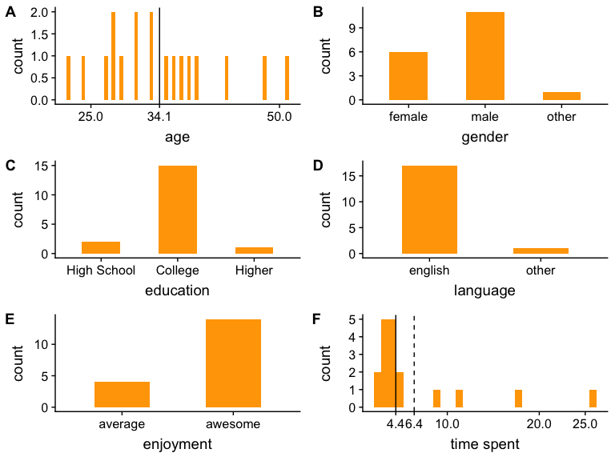

CI: object naming analysis
================

### About the participants (after exclusion)

Object descriptions
-------------------

#### 1 label

Participants uniformly used the same label for these items. They used the label that we expected.

#### 2 labels

All of them look still good. There are some troubles with swan (vs. goose) and bicycle (vs. bike). But at least the bicycle case should not have a strong effect.

#### 3 labels

Problematic: zucchini, sportscar (most frequent label: car)  Okay: pig, taxi, pickle?, jacket?  Taxi is probably fine because "taxi" and "taxicab" still start the same way. Sportscar and jacket? 

#### More than 3 labels

Lettuce analysis see below.  Problematic: traffic cone, billiard ball (note that "poolball" is far more frequent), tack, bell pepper   Okay: cup (but the label is "mug")

#### Lettuce item

Proportion of cases where the label was not simply "lettuce", split by whether it came before the second lettuce or after. For both lettuces, the proportion of modification increases when participants see it after they saw the other one. The first lettuce occurrence is more relevant. Here, iceberg was always referred to as "lettuce", but romaine sometimes wasn't. The iceberg lettuce seems to be a clearer prototypical item.

    ## # A tibble: 6 x 4
    ##   refexp          trial_number item                  anon_worker_id 
    ##   <chr>                  <dbl> <chr>                 <chr>          
    ## 1 iceberg lettuce           38 green_lettuce_iceberg 798809405482655
    ## 2 lettuce head              23 green_lettuce_iceberg 018788711297656
    ## 3 iceberg lettuce           33 green_lettuce_iceberg 647946116508632
    ## 4 cabbage                   28 green_lettuce_iceberg 605831246779009
    ## 5 iceberg lettuce           45 green_lettuce_iceberg 667989923066022
    ## 6 head of lettuce           25 green_lettuce_iceberg 100078842692566

    ## # A tibble: 5 x 4
    ##   refexp          trial_number item          anon_worker_id 
    ##   <chr>                  <dbl> <chr>         <chr>          
    ## 1 romaine lettuce           24 green_lettuce 963617154322865
    ## 2 romaine lettuce            7 green_lettuce 647946116508632
    ## 3 vegetable                 29 green_lettuce 352436319852900
    ## 4 romaine                   41 green_lettuce 304234736475744
    ## 5 romaine lettuce           13 green_lettuce 100078842692566
