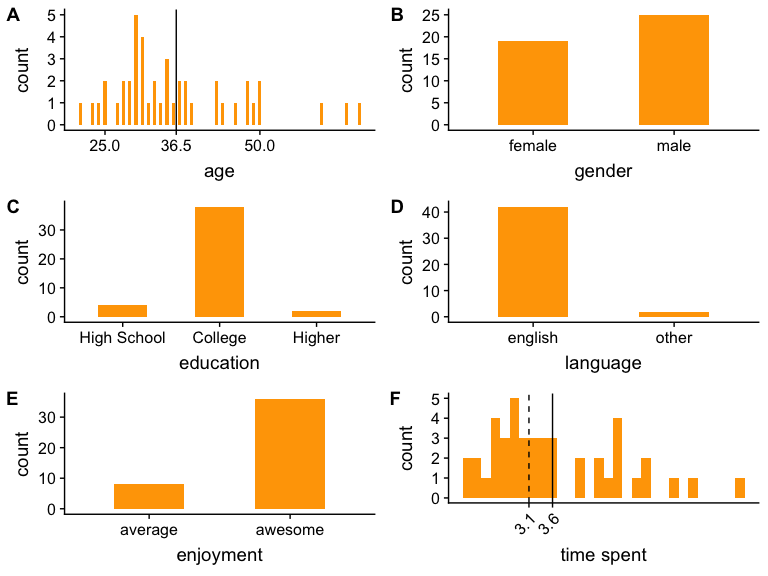
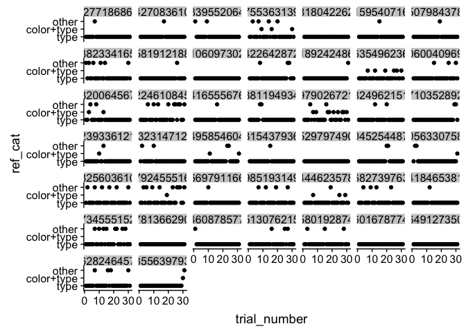

CI: object naming analysis
================

### About the participants (after exclusion)



Object descriptions
-------------------

#### Color diagnostic objects

"other" utterances: swan is often called a goose; two people identified the white carrot as parsnip


#### Non-color diagnostic objects

"other" utterances: mug is still often called a cup; jacket is often called "coat"


### In-participant variability

``` r
df_part = df_plot %>% 
  filter(ref_used)

ggplot(df_part,aes(x=trial_number,y=ref_cat)) +
  facet_wrap(vars(anon_worker_id)) +
  geom_point()
```


