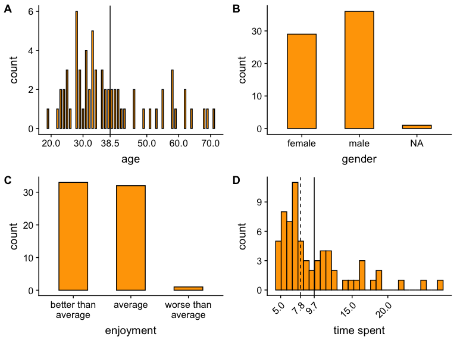
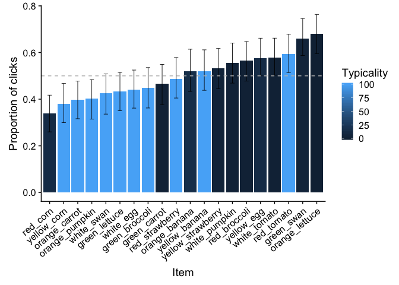
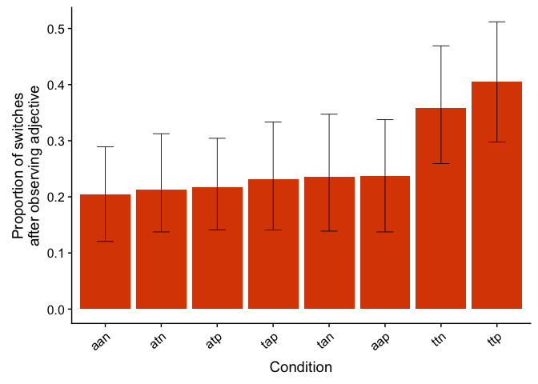
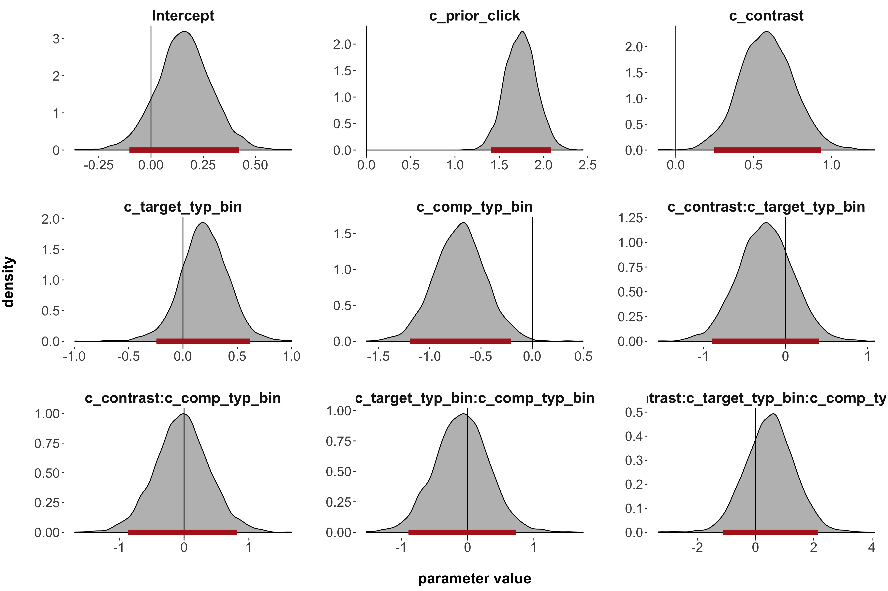
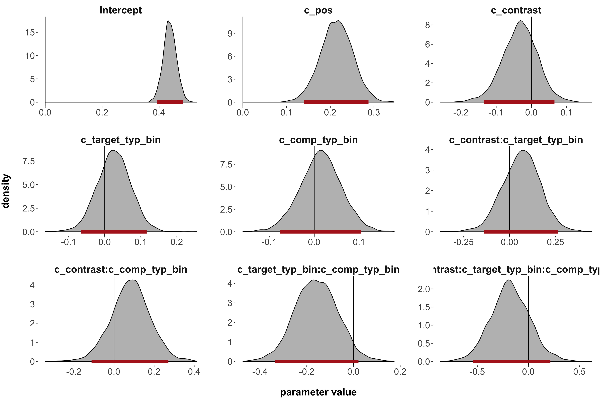

CI: IDT analysis
================

Subject pool
============

80 participants were recruited (40 per color competitor typicality condition).

Exclusions
----------

We excluded participants who indicated that they did the Hit incorrectly or were confused (7), who indicated that they had a native language other than English (4), who gave more then 20% erroneous responses (2) and who did the Hit multiple times (1). Overall, we excluded 14 people. 33 participants per condition, i.e., 66 in total, remain.

About the participants (after exclusion)
----------------------------------------

There are no apparent anomalies in the age and gender distributions of our participants and the general feedback was neutral to positive. We expected that it would take participants approximately 7 minutes to complete, which seems to be reflected in the time they spent on it.

Main Trials
===========

Recap: Typicality ratings for stimuli
-------------------------------------

These are the stimuli used as targets and distractors in the study. They were normed according to their nameability and typicality in previous norming studies. We refer to objects with typicality ratings above 50 as *typical*ly colored and below 50 as *atypical*ly colored objects. The colors of the objects between the two categories are counterbalanced, i.e., there as many typical red things as there are atypical red things.

Priors -- clicks before adjective or noun onset
-----------------------------------------------

To investigate the priors that participants have for particular contexts, we look at the filler as well as the critical trials.

#### Overall bias

Is there an overall bias already in the object selection before any linguistic cues? We can see a slight tendency for a preference of the objects that share a color (target and competitor), but the difference is minimal.

#### Contrast bias

If a contrast object is present, is it more likely that the target/contrast are selected?

Overall, there does not seem to be a bias in favor of the two objects that are in contrast. However, we see there is learning curve where in the second half of the experiment (here in darker colors/higher alpha), target selection becomes more likely when a contrast is present.

#### Atypicality bias

Is there an atypicality bias, i.e., is the proportion of clicks on atypical object higher than typical ones? No, the probability of clicking on an item seems not to be connected to the typicality of it in the prior. This could be due to the fact that people don't have any information yet and therefore the clicks are rather driven by other things that don't have anything to do with the objects themselves (e.g., position in the grid).

TODO: Does this make sense?

#### Position bias

Is there one position on the grid that is preferred? Yes, in fact the two upper grid cells. Further analysis suggests that the bias is not learned throughout the experiment, because the target was equally likely to occur in the bottom two grid cells (and in fact did) and the pattern remains unchanged over trial halves. This could be connected to the fact that the utterance stood above the grid.

#### By-item bias

Overall, there seems to be cluster suggesting that participants had a tendency to prefer typical over atypical objects. The green swan (which is highly atypical) is an exception, as it is highly atypical but was selected very often. Given that the swan is the only atypically colored animal it might be salient in some way. The orange pumpkin and the green swan are the only items where the error bars don't include the chance baseline (here in grey). Both are a priori selected more often than expected by chance.

TODO: Do by-item analysis for random grid position. Can this explain the green-swan/orange-pumpkin anomaly?

After adjective -- partial information available
------------------------------------------------

From now on, we will only look at the critical trials.

#### Overall selection pattern

The color is already known such that target and color competitor are possible targets, but not the two distractors. Clicks on these two should be considered wrong. There were overall 19 wrong selections which are 0.4% of the data. Those trials will be excluded in the upcoming analyses.

Overall, we do not see a strong target preference, independent of condition.

    ## # A tibble: 1 x 1
    ##   error_rate
    ##        <dbl>
    ## 1    0.00360

#### "Replication" of the Sedivy (2003) case

Is there a contrastive inference effect in the case closest to the original studies? Here target and color competitor are typically colored objects and the two conditions only vary wrt whether there is a contrast present (ttp vs. ttn).

The contrastive inference effect would predict that as soon as there is a contrast present, it is more likely that we consider the target as the actual target (even before observing the noun).

This is in fact what we see in the data. When there is no contrast present, the selection of target and competitor is at random. However, if a contrast is added, there is a clear target preference. Note that this effect is not present yet in the prior, which suggests that it is directly connected to the use of the adjective.

#### "Replication" for atypical objects?

Are typicality considerations relevant for the contrastive inference effects? If we assume that contrastive inference is a phenomenon that just depends on the lexical category of the adjectives, the typicality of the object should be irrelevant. However, we see a clear pattern difference here to the typical conditions from before. When a contrast is present, the two atypical items are still essentially chosen at random and there is not much difference from the prior.

TODO: explain issue with aan condition (including prior)

#### Hierarchy extremes

Do the contexts that are most distant from each other in the hierarchy differ? In atp, all cues suggest that the target should be the target; in tan, there might be a slight tendency for the color competitor. We see a clear pattern difference in the atp context, as opposed to the tan context.

#### Contrast bias

Independent of typicality, there is an overall preference for the object with the contrast (i.e., the target) that exceeds the difference in prior. This pattern is unchanged when we only consider the conditions in which target and competitor have the same typicality (i.e., ttp and aap).

#### Atypicality bias

Independent of contrast, there is an overall preference for the atypically colored object, when target and competitor differ in typicality. Crucially, we do not see this difference in the prior but only after the adjective was observed. This pattern is unchanged when we only consider the conditions in which the contrast is absent and typicality differs (i.e., atn and tan).

#### Overall patterns per condition

We see a target boost/competitor reduction though in all conditions. However, if the aan condition was random, there wouldn't be one and there is only a small one in the atn-atp.

#### By-item analysis

We see a shift here compared to the prior. Now atypical items are more likely to be clicked on than typical ones.

#### Switching behavior

Do people switch from their prior selection when they don't have to (due to informativity)? Mainly they don't, but there are differences in the patterns for different conditions.

Generally after observing the adjective, participants rather stay with the item they have clicked before. When participants switch there is a trend rather to switch from the competitor to the target than vice versa (conditions: ttp, atp, aap, atn, aan). In two conditions, the direction of switches seems to be arbitrary (conditions: tap, ttn). There is one condition, where there seems to be a tendency of more switches to the competitor after observing the adjective (condition: tan).

TODO: rewrite!

#### Post-infelicitous trial responses

We predict for the production data that a listener is unlikely to expect a color term for the target when it is typical, but the color competitor is atypical (and there is no contrast). Mentioning the color here could even be seen as misleading. Does this affect the interpretation of the following trial?

We don't see strong differences between the context that could occur after such a trial and before. This is clearly the case in the aap and tap conditions. In the aan condition, the difference between target and competitor seems to increase. Note however that the confidence intervals don't overlap in either case, which suggests at least a similar effect. The tan condition is particularly interesting. One could interpret it as a little more uniform and the error bars overlap now compared to all trials combined, but overall, there is no real effect observable.

After noun -- all information available
---------------------------------------

We will only look at the critical trials.

#### Reaction time difference

Is there a difference in reaction time between the atp and tan context (i.e., the two contexts furthest apart in the hierarchy)? No, we don't see any difference in reaction times. (Note that outliers with reaction times above 4000 are excluded here.)

#### Multiple selection/Error pattern

Is there a pattern to where the most errors/multiple selections occur? I don't see a pattern here.

Statistical analysis
--------------------

#### After adjective: preregistered

When we ignore the prior probability, contrast presence and competitor typicality come out as main effects. Target typicality and interactions are not significant.

However, when we include the prior probability as a (main) predictor, only the prior and target typicality come out as main effects, but everything else as not significant.

When we include the targets position in the grid (i.e., the only significant predictor for the prior), but not the prior itself, position, contrast presence and competitor typicality come out significant.

TODO: continuous typicality values don't let the model converge

#### After adjective: with prior click predictor

#### After adjective: model comparison

 <!--  -->

#### Predicting prior clicks

The prior distribution is mainly explained by the position, i.e., a target selection was more likely when it occurred in one of the two upper grid cells.

TODO: fixed error; need to update description

#### Predicting aan condition (prior)

#### By-item & condition analysis

Generally
---------

#### Is there an overall target position bias? (We need this to address the position bias question in the prior, if existent. But for this we also need to consider the fillers and not just the critical trials.)

TODO: was there a skew in whether typical or atypical things were more likely to occur in the upper two grid cells

TODO: make plot that shows how often each item occurred in which position

#### By-item analysis -- which items were most likely to be targets?

Because there were a lot of unmodified expressions in the fillers that could only refer to typical objects, typical objects were in general more likely to be the target. This is not true for the critical trials.

#### When do most multiple selections occur (prior, after adj, after noun? is there a condition-wise split? a first/second half of trials split?)

    ## [1] 121

    ## 
    ## selectedItem_prior      selectedItem1      selectedItem2 
    ##                 15                 74                 32

    ## 
    ## aan aap atn atp tan tap ttn ttp 
    ##   6   9  13  18  17  20  19  19

    ## 
    ##  first half second half 
    ##          57          64

    ## [1] 39

    ## 
    ## selectedItem1 selectedItem2 
    ##            19            20

    ## 
    ## aan aap atn atp tan tap ttn ttp 
    ##   7   7   5   6   5   1   6   2

    ## 
    ##  first half second half 
    ##          17          22

Practice Trials
---------------

Some people used location descriptions like "top right" or "bottom coat"/"left flower". There are also wrong descriptions like reference to the "wooden chair".

TODO
====

-   inspect by-subject variance: Are there maybe subjects who have a clear typicality or contrast preference? Does it change over time?
